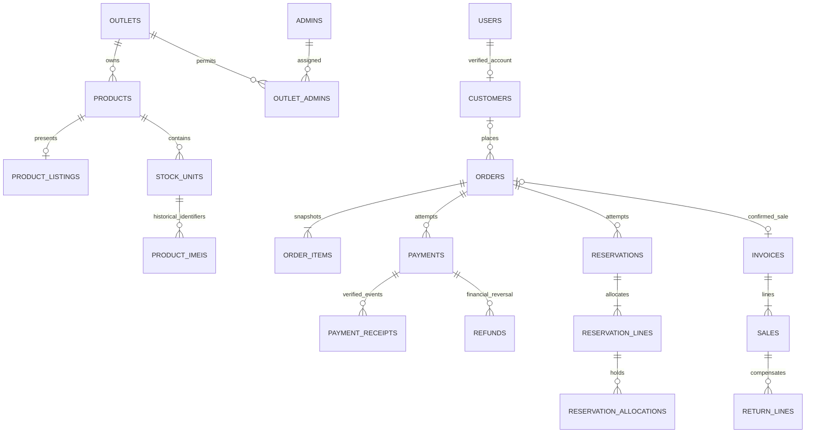

# MT-1.2 - Unified data design

Status: Design accepted for implementation by this checkpoint; no schema, application or business-data migration has run. Implementation and MySQL validation remain MT-1.3/MT-2.* and MT-7.1 gates.

## Authority and source evidence

Apply the approved Goal and Preferences without changing their bytes. The input is the MT-1.1 inventory at POS `c61e47394e7b3db8a49cfe443c85b63835febc9b` and Website `04e7c49518f9f11f60c83ad44f9f4e2fd2539066`. `../migration/SOURCE_SYMBOL_INVENTORY.json` provides source-line declarations and `SCHEMA_MAPPING.json` maps every source table mentioned by the 79 migration files and every one of the 42 models. It is a logical migration contract, not an executed schema dump; later rehearsals must compare actual authorized exports against it and reject unknown columns.

Important source anchors: POS `app/Models/User.php` represents an outlet; `Admin.php` defines nine operational and nine configuration permissions; Website `User.php` defines four admin roles and denies admins entry to the customer portal through `EnsureCustomerAccount`. POS `BusinessIdentifier` defines immutable outlet/product/unit/invoice/claim identifiers. `2026_08_22_030000_allow_imei_reuse_after_sale.php` explicitly allows an IMEI to re-enter stock after a past sale. Website `WebsiteOrderManagementController::update` records return/refund status and physical receipt metadata, but does not prove a gateway refund or a stock mutation. These distinctions constrain the design.

## Decisions

| ID | Decision | Reason and retained behavior |
|---|---|---|
| D-01 | One Laravel 13 application and one MySQL schema own all business state. | Reuse existing Laravel services and validators; remove inter-application database replication only after parity. Next.js is a REST consumer. |
| D-02 | Retain separate existing authentication providers in the shared schema: `admins`, `super_admins`, and Website `users`; move POS `users` to `outlets`. | A shared database does not require merging unrelated accounts or rewriting working guard semantics. Same email/ID in different providers does not identify the same account. |
| D-03 | Add a shared `customers` business entity, separate from login credentials and immutable document snapshots. | POS has invoice/customer snapshots, not a proven customer-account primary key. Account linking must never grant historical ownership from a phone/email match alone. |
| D-04 | POS `products` and inventory remain the stock/price authority; Website catalogue metadata becomes `product_listings` linked to those products. | Preserve Website slug/content/reviews/visibility and source catalogue identity without a second authoritative stock/price copy. |
| D-05 | Website `orders`, `order_items`, `payments` remain commerce records; POS integration reservations become local `reservations`, `reservation_lines`, `reservation_allocations`. | Reuse allocation, confirmation/release and payment verification rules inside one transaction boundary. Archive old transport evidence, not the business invariants. |
| D-06 | Keep `pos_*` and `site_*` configuration/revision/media namespaces initially. | Their permission, publication and history semantics differ. Shared storage and brand masters do not justify destructive settings-table consolidation. |
| D-07 | Use exact decimal money, integer quantities and database-enforced uniqueness/relationships. | Source float calculations and application-only duplicate checks are risks to strengthen while preserving expected historical amounts. |
| D-08 | Preserve completed records and snapshots; use compensating return/refund records rather than rewriting sales. | Historical invoices, warranty clauses, costs, operator/outlet details and payment receipts remain reproducible. |

## Relational layout and ownership

All tables reside in the same target schema. InnoDB transactions are required. MySQL 8.4 LTS is the design baseline; MT-1.3 pins an available supported patch and verifies the Windows runtime. Use `utf8mb4`, strict SQL mode, UTC `DATETIME(6)` timestamps and explicit indexes. Human text uses an appropriate Unicode collation; external identifiers, idempotency keys and cryptographic digests use binary/case-sensitive comparison. Do not let collation silently merge identifiers. MySQL `DECIMAL` stores exact fixed-point values; application calculations must also avoid binary floats. [MySQL exact-value types](https://dev.mysql.com/doc/refman/8.4/en/fixed-point-types.html)

Internal primary/foreign keys are unsigned BIGINT with matching types. Public mutable resource identifiers are separate random UUIDs represented as strings; never treat an opaque ID as authorization. Preserve existing public order numbers, slugs, project references and business codes as immutable aliases. New IDs never overwrite original source IDs in provenance. Existing historical code generation must not be rerun using remapped IDs.

One physical-product checkout is limited to one outlet, as in `WebsiteOrderReservationService`; reject mixed-outlet checkout with a field error. Do not silently split an order or introduce new shipping/payment semantics. Digital orders use approved project quotes and do not allocate stock. A Website order may have multiple payment/reservation attempts, but only one successful stock consumption and linked POS invoice. POS walk-in sales have no Website order requirement.

### Core tables and constraints

| Table/group | Key fields and relationships | Invariant |
|---|---|---|
| `outlets` | POS shop profile, `outlet_code CHAR(3)` unique, active/archive state | Preserve `001`-`999` and branch-specific contact/address; do not revive retired shop passwords. |
| `admins`, `super_admins`, `users`, `outlet_admins` | Existing credential/profile columns; mapped outlet/admin FKs; unique outlet/admin pair | Keep source guards, permission lists and Website admin roles. No union of privileges across accounts. |
| `customers`, `customer_source_links` | Customer public UUID; nullable unique `website_user_id`; source/record link with verification reason | Only non-admin Website users may own customer accounts. A POS snapshot is not proof of account ownership. |
| `products` | Outlet FK, immutable `product_code`, source category/master-data FKs, price/cost, stock mode and quantity | Keep protected `mobile_phone`, `tablet`, `accessory` semantics and existing variant-key algorithm. Source blank/unknown attributes remain distinct. |
| `product_listings` | Unique product FK; Website slug unique; public description/media/publication metadata; former Website product ID in mapping | Public availability/price read the canonical product/allocation state. Do not import cached stock as inventory. |
| `stock_acquisitions`, `stock_units`, `product_imeis`, `stock_movements` | Preserve acquisition/cost/source-document lineage, unit code, sale/invoice links and before/after quantities | No duplicate active ownership of a physical unit. Past IMEI reuse remains legal; movement history is append-only. |
| `active_imeis` | Normalized IMEI primary key, stock-unit FK, slot number; unique `(stock_unit_id, slot_no)` | Reserve one active stock identity per IMEI across outlets. Remove active claim on sale/adjust-out, retain history; re-entry creates a new acquisition/history occurrence. Quarantine existing conflicts. |
| `invoices`, `sales`, `claims` | Outlet/operator FKs, immutable source numbers, monetary columns, customer/business/product/warranty snapshots | No cascading delete of financial/warranty history. Archive actors/products instead. Preserve source claim lifecycle, expiry and clause version. |
| `orders`, `order_items` | User/customer FKs where verified; order number unique; item product/listing/outlet/quote links plus immutable title/price/variant snapshots | Source customer/contact/outlet snapshots remain readable even after profile/catalogue changes. |
| `reservations`, `reservation_lines`, `reservation_allocations` | Order FK, attempt number, expiration/state, order-item FK, product/unit and quantity; nullable unique active-unit key | Unique `(order_id, attempt)`; at most one current holding attempt per order. No line quantity exceeds available canonical stock. |
| `payments`, `payment_receipts` | Order FK, gateway/merchant/mode, amount/currency, attempt key; verified event/transaction IDs, received/verified timestamps | Gateway transaction identity is unique in `(gateway, merchant, mode, transaction_reference)` when present. A callback receipt cannot pay two orders. |
| `returns`, `return_lines`, `refunds` | Original invoice/sale/order/payment links, quantities, inspected disposition, amounts, actor/reason/provider evidence | Returned quantity cannot exceed sold less prior accepted returns; total verified refund cannot exceed collected money less prior refunds. Status labels are not payment evidence. |
| `digital_services`, `service_requests`, `project_quotes`, `product_reviews` | Preserve source relationships, references, secure token lineage and review eligibility/moderation | Quote price/currency comes from approved server data; reviews require the source eligibility/ownership rules. |
| `pos_*`, `site_*` settings/revisions/media; audit/backup tables | Retain source fields and namespaces; map actor IDs/paths; add explicit revision/hash/version metadata when needed | Publication permission differs from edit permission. Preserve historical snapshots; never combine secret values with public settings. |
| `idempotency_requests` | Unique `(actor_scope, operation, key)`; canonical request hash, resource link, status and redacted response | Same key/different request is a conflict; durable unique business keys survive response-cache expiry. |
| `domain_events`, `publication_versions` | Transactional event ID, aggregate/version, allowlisted type; current domain version | Commit event/version with business changes. Events are retryable work signals, not another business master. |
| `document_sequences` | Unique document namespace/outlet/date key and next sequence | Lock before allocation, enforce final code uniqueness. Never allocate with `MAX(id)+1`; preserve imported codes unchanged. |
| Migration metadata | `migration_runs`, `migration_identity_map`, `migration_quarantine`, `migration_reconciliation`, `migration_source_history` | Every imported record is traceable; rejected/merged records are accounted for. No private source rows in Git. |

Keep original source columns by default, including flags, historical timestamps, hashes and snapshots. `SCHEMA_MAPPING.json` carries the exact migration-declaration evidence; it is not permission to drop an unlisted field. MT-2.1 must compile a column-by-column destination manifest from the inspected schema and authorized sanitized fixtures, with explicit transforms for every changed column. Unknown source fields, truncated strings, unsupported enum values, invalid dates and broken relationships fail the import instead of being silently discarded.

Composite references must enforce outlet consistency: products are unique by `(id, outlet_id)` and lines/stock operations validate or reference the matching outlet. Financial and audit relations use RESTRICT/archival semantics. Truly optional historical references may be null only with retained source identifier/snapshot and a reconciled reason. Media usage and private acquisition-document relations must prevent deleting referenced content. Framework sessions/cache/jobs/tokens are not business rows to blindly copy.

## Identity and record migration

The source key is `(source_repository, source_table, source_primary_key)` stored as strings. `migration_identity_map` adds `target_table`, `target_id`, source-row digest, migration version and outcome. Uniqueness covers the source key plus target table, so a Website product can map to both its canonical product and its listing without duplicate imports into either table. Many-to-one mapping requires an explicit reviewed merge record. Table names and source integer IDs are never enough to identify a record across repositories.

1. Establish a run manifest from code/schema hashes, export checksum, source timezone, counts and permitted target identity. H-03 remains required for any real export. No source credentials/data are accessed in this design point.
2. Load outlets, master data, authentication providers and base entities. Allocate target internal IDs and map them deterministically within the run; retain old IDs only when conflict-free and recorded. Re-runs resolve existing mappings and compare digests; changed input requires a new reviewed run, never blind upsert over target writes.
3. Map POS products to canonical products. Website `external_source=mobist-pos` plus `external_id` is a candidate link only after referenced POS product, outlet, category and contract identity agree. Map Website slug/media/content/reviews to its listing. Unmatched or ambiguous Website catalogue rows stay quarantined/unpublished; no guessed product or synthetic stock.
4. Map Website order/payment records and POS reservation/order records by verified source order number plus line IDs, outlet/product mappings, money/currency and contract hash. Source POS invoice linkage must match, preventing an already-confirmed order from generating another sale. Preserve unmatched historical evidence separately until resolved; active unmatched obligations block cutover.
5. Import dependent items, units/IMEI history, acquisitions/movements, invoices/sales/claims, reviews, quote/request links, settings/revisions/media usage and audits in FK order. Preserve source event timestamps and actor realm. Use the stored historical snapshots even when they differ from current master data.
6. Validate counts by outcome (`imported + explicitly merged + quarantined + approved excluded = source rows`), relationships, product/outlet quantities, money by currency/state, invoice/sale totals, reservation allocations, payment/refund references and file hashes. Any discrepancy in an active order, payment, stock quantity or historical financial control total blocks promotion.

### Customer linking rules

- A non-admin Website user becomes exactly one shared customer account through its existing user ID mapping. Keep password hash algorithm/parameters; do not decrypt passwords or bulk-reset them without a verified need. Source remember tokens, reset tokens and sessions are invalidated at cutover, with a re-login/recovery path.
- Preserve guest Website orders as guest orders; their source order ownership or signed capability is not converted into a registered account solely by matching contact data.
- Create separate POS customer observations for invoice snapshots. Normalized email/mobile/CNIC may suggest a review candidate but never automatically merge or grant access. A validated existing account link or explicit audited operator/customer verification is required.
- Merge records retain aliases, source lineage, before/after ownership and an auditable reversal path; they never rewrite invoice/customer/warranty snapshots. Same normalized email in different guard tables remains separate. Collision inside one login realm is quarantined; do not append characters to a login and silently change access.
- No credentials or roles move through a customer merge. Website owner privileges do not imply POS super-admin privileges; POS outlet membership is never derived from a Website order.

### Money, quantities and time

Use `DECIMAL(19,2)` for persisted money, ISO currency `CHAR(3)` and decimal strings in JSON. Initial accepted transaction currency is PKR; reject unsupported currencies, exponent notation, negative payable amounts and more than two fractional digits at API boundaries. Use integer minor-unit or exact-decimal arithmetic in Laravel and browser display helpers; never `float` totals or JavaScript Number arithmetic for authoritative calculations. Integer unit quantities remain whole numbers, with 1-20 per Website checkout line and at most 50 lines as in the source contract.

Prices are read and checked under transaction locks at checkout. Incoming expected price/version detects change but is never authoritative. Line total is quantity times unit price; invoice discount is allocated deterministically by proportional minor units with residual units assigned in stable line-ID order, and sum of allocations equals the header discount. Tax/shipping values cannot be invented during migration; preserve verified source totals, and introduce new rules only when separately scoped. Per-line net cannot be negative. Historical source arithmetic is compared at the stored two-decimal result; retain the original amount and quarantine inconsistencies rather than recomputing old invoices.

Preserve `MST-*` product/unit/invoice/claim identifiers, Website order/invoice numbers and project references exactly, including leading zeros. Existing source invoice numbers and shared target invoice references may coexist as aliases, but only one financial sale is counted. Keep UTC instants plus source timezone metadata; use Asia/Karachi for local business-date rendering and preserve original date-derived codes. Invalid or ambiguous historical dates require review, not conversion using today's timezone.

## Recovery, encrypted data and files

Backup scope covers the complete shared schema, media/object version manifest, migration maps, code/lock/schema hashes and secret-key identifiers. It must include Website commerce/CMS/credentials as well as POS tables; the old POS-only REQUIRED_TABLES list is insufficient. Separate encrypted key escrow from encrypted data backups; a backup without the matching authorized keyset cannot prove recovery.

Keep source encrypted payloads and their source key identity opaque until a separately authorized isolated migration can decrypt, verify and re-encrypt under a new target key. Never read source `.env` or put keys/plaintext in Git, commands, test logs or public responses. Missing/wrong keys fail the relevant recovery gate and leave providers disabled; do not replace undecryptable values with empty settings and call that a successful restore. Laravel supports prior-key decryption during rotation, but historical source keys belong in a controlled migration/escrow process, not an indefinitely expanded application key list. [Laravel encryption and key rotation](https://laravel.com/framework/docs/13.x/encryption)

Keep POS and Website secret revisions logically scoped. Credential replacement exposes only configured/version/masked metadata; a settings rollback must not resurrect a rotated/revoked secret. Restore tests verify ciphertext integrity, key identity, record/file hashes, media usages and absence of secrets in output. Password hashes are not reversible encryption and are migrated without decryption. Signed URLs generated with old APP_KEY are not automatically valid on the new host; issue replacement capabilities through verified recovery or authorized migration, never by accepting arbitrary legacy signatures.

Private acquisition CNICs, backups and sensitive media use private target storage with per-object authorization and short-lived links. Public approved brand/media derivatives use separate allowlisted paths. No source path is carried into runtime configuration. Preserve source object hash/path provenance while copying only authorized media via a validated object manifest; normalize paths and reject traversal, symlinks, executable content and unexpected archive entries.

The existing Google Drive/rclone backup integration remains a compatibility candidate under MT-3.3: preserve useful configured backup/verification behavior through a target-only allowlisted adapter, or document a verified replacement before retirement. Do not carry arbitrary executable paths/commands or old destinations into the new runtime. S3 is the preferred target object-storage interface, not permission to silently remove an existing required backup integration.

### Promotion and rollback contract

Use expand/import/validate/promote against an isolated target database, not destructive in-place conversion of originals. Source applications remain unchanged; live cutover remains H-01/H-03. No dual-write or bidirectional synchronization phase is designed. Before any future cutover, authorization must establish a consistent immutable input snapshot and a no-writes transition window; otherwise promotion stays blocked.

Before target writes begin, a failed rehearsal discards or restores only the exact verified target. After target writes begin, switching users back to stale sources is unsafe: retain target journal/data, pause affected target writes and recover forward or restore target backup plus verified post-backup events. Never push target mutations back into original databases. Provider side effects cannot be undone by rolling back SQL: reconcile receipts and use explicit compensating refund/manual recovery. Target-only restore requires environment, host/schema, manifest/code/key checks and a separate destructive confirmation at the relevant gate. Always run verify-only first; preserve forensic evidence and previous recoverable backup.

## Acceptance handoff

MT-2.1 must prove MySQL FK/uniqueness/decimal/rollback behavior; MT-2.2 proves role and customer collision cases; MT-2.3/2.4 prove mapping/stock/IMEI integrity; MT-2.5-2.7 prove history/returns/payment allocation; MT-3.2/3.3 prove CMS/key/file recovery; MT-7.1 proves full import and rollback reconciliation. `DESIGN_ACCEPTANCE_CASES.json` links these required cases. No SQL migration, live export or target-runtime test is claimed by MT-1.2.
