# Mobisttech User Manual

**Roadmap point:** MT-7.6 - Product user manual and administrator operations guide  
**Product:** Mobisttech / mobiST Technologies  
**Canonical manual:** this Markdown file  
**Status:** In Progress - operational text baseline complete; safe screenshot capture, DOCX/PDF mirrors and final visual QA remain pending.  
**Development baseline:** MT-7.5 = 27/27 DONE DEVELOPMENT, terminal Q01 run `36138681492`.

## 1. Purpose and safety boundary

This manual explains the final verified Mobisttech application as implemented in the canonical repository. It is role-aware: a control may be absent or denied when the signed-in Admin/Team Member lacks its backend permission or active outlet assignment.

This manual does **not** authorize production deployment, live payment activation, real customer-data operations, destructive production resets, legal-policy publication, or external-provider use. Those actions remain governed by `docs/HOLD_PRE_LAUNCH_REGISTER.md`.

Never:
- enter or store raw card PAN, CVV or PIN in Mobisttech;
- treat an assisted WhatsApp handoff as a verified delivery;
- publish legal text that has not completed the required owner/legal review;
- run destructive reset/restore actions against production without the separate approved authorization and recovery procedure;
- expose private customer, supplier, IMEI, payment or project-file data outside its authorized scope.

## 2. Application surfaces

Mobisttech has four user-facing operational surfaces:

1. **Admin/POS** - protected Laravel application for retail, inventory, warranty, reporting and platform administration.
2. **Customer Website** - public/customer Next.js application for products, services, checkout, account, projects and published Software Products.
3. **mobiST Control** - Windows operator utility for local application lifecycle.
4. **Recovery/operations tooling** - guarded backup, integration and reset administration.

Default local development endpoints are loopback-only. Do not advertise a LAN/QR URL for the current target unless the application is deliberately reconfigured and separately verified for that purpose.

## 3. Signing in, account security and outlet context

### 3.1 Admin and Team Member access

Use the protected Admin sign-in page. The backend decides the effective permissions, role membership and outlet assignments; hiding a navigation item never grants or removes the underlying permission.

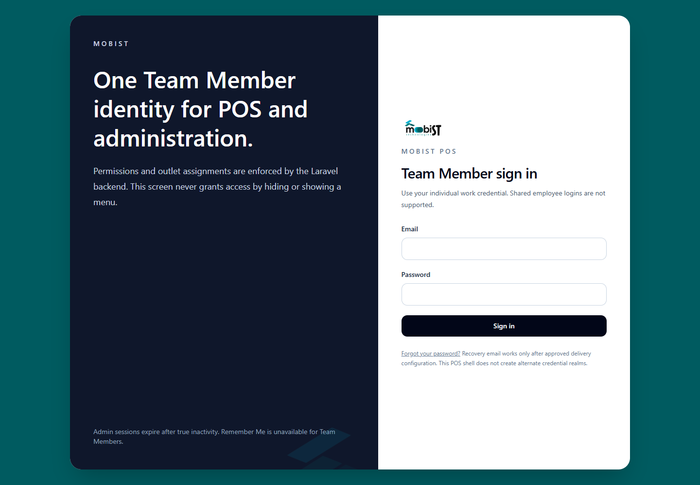

After sign-in:
- use **My account** for your own profile/security information;
- select an active outlet before entering outlet-scoped POS workspaces;
- if you have no assigned open outlet, POS entry remains unavailable even when you hold a POS permission;
- if your account or outlet is archived/closed, access is denied by the backend.

### 3.2 Active outlet

The POS shell uses one active outlet in the signed-in session. The outlet selector is not a data filter that can bypass authorization: only outlets currently assigned to the user can become active.

Changing outlet changes the operational scope for stock, sales, customers, warranty, cash, reports and other outlet-owned work.

### 3.3 Session security and logout

Admin and Customer realms use separate protected sessions. Signing in to one realm does not sign you in to the other. Password/reset/security changes may rotate the authentication version and invalidate older sessions.

Operational practice:
1. sign out when leaving a shared workstation;
2. do not share one Admin identity between staff;
3. use Team Member/role delegation instead of sharing credentials;
4. re-authenticate when a protected recent-auth action requests it;
5. investigate unexpected session replacement or repeated login prompts instead of bypassing them.

### 3.4 Roles and permissions

Common operational POS permissions include:

| Permission | Purpose |
|---|---|
| `shops.enter` | Enter assigned outlets |
| `shop.sales` | Create sales and POS invoices |
| `shop.inventory` | Manage products, units and stock |
| `shop.invoices` | View invoices and customer sale history |
| `shop.warranty` | Warranty intake |
| `shop.claims` | Warranty claims |
| `reports.view` | Outlet reports |
| `shop.cash` | Operate cash sessions |
| `shop.cash.approve` | Approve variances/expenses |
| `shop.procurement` | Supplier procurement |
| `shop.stocktake` / `shop.stocktake.approve` | Stock count / variance approval |
| `shop.transfers.dispatch` / `shop.transfers.receive` | Stock transfers |
| `shop.documents.send` | Send customer documents |
| `shop.payments.reconcile` | Reconcile POS settlements |

Configuration, Website, Team Member and destructive permissions are deliberately separate. The Platform Administration permission catalogue is the authority for assignment.

Recommended supplied role templates are authorization bundles, not separate account types:

| Role/template | Typical scope (only when explicitly delegated) |
|---|---|
| Full Access | Protected primary administrative authority across approved POS/Website/configuration/integration/reporting/team functions |
| Manager | Cross-business management within the actor's delegated ceiling |
| Store Manager | Assigned-outlet operations, stock, staff and reports |
| Sales Associate | Sales, invoices and customer-facing retail work |
| Cashier | Register, collection and cash operations |
| Inventory Manager | Products, receiving, stocktake, transfers and stock control |
| Service & Warranty | Warranty, claims and paid-service/repair work |
| Online Store Editor | Website pages, CMS, navigation, content and media |
| Merchandiser | Catalogue, categories, pricing/presentation and merchandising |
| Customer Support | Authorized customer/order support without unrelated administration |
| Digital Operations | Leads, projects, proposals, milestones, consultations and client files |
| Custom Role | Administrator-defined bounded permission bundle |
| Website Customer | Separate Customer realm; own Website account/order/project data only |
| Local Windows operator | mobiST Control/local application lifecycle only; no implicit Admin authority |

Job Title is descriptive only and grants no authority. A Manager cannot delegate permissions/outlets above the Manager's own ceiling, and protected Full Access requires its separate authority.

## 4. POS home and workspaces

The protected POS navigation is generated from current effective permissions and presentation settings. The standard workspaces are:

- **Sales**
- **Inventory**
- **Invoices & customers**
- **Warranty**
- **Claims**
- **Master data**
- **Outlet profile**
- **Reports**
- **Operations**

Navigation labels/order/visibility may be customized for presentation. A hidden item remains protected by its normal backend permission and may still be reachable only by an authorized direct route.

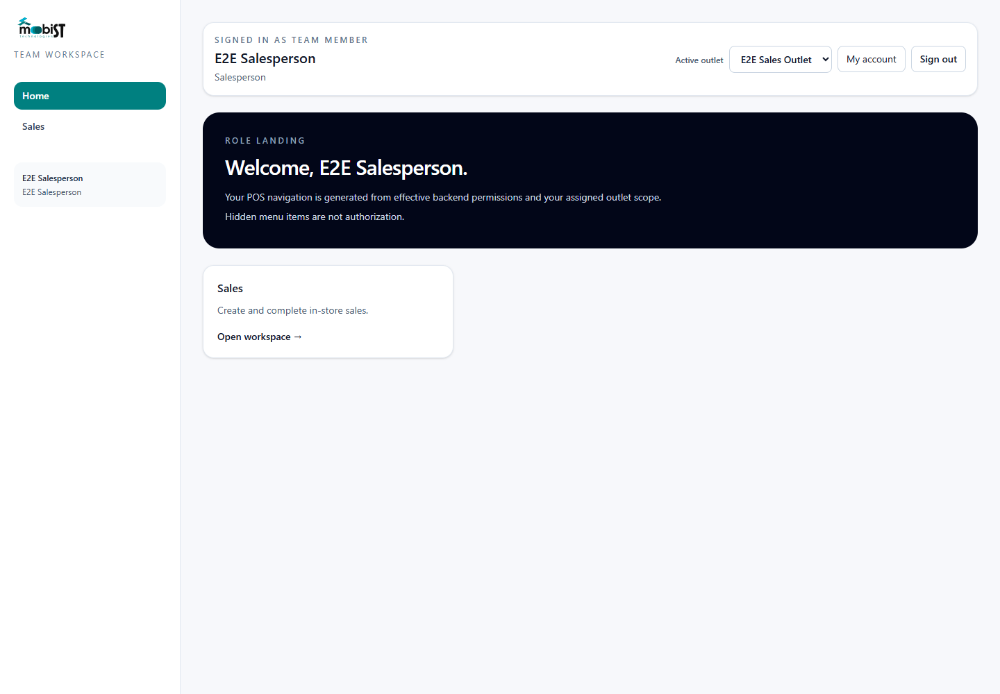

## 5. Sales, payments, returns and refunds

### 5.1 Start a sale

1. Select the correct active outlet.
2. Open **POS > Sales**.
3. Find products through the catalogue/search/scanner-friendly lookup.
4. Add the required product/unit quantities.
5. For serialized devices, select only eligible in-stock units with complete required IMEI data.
6. Add/select the customer when the sale requires customer history/warranty details.
7. Review the server-calculated totals before finalizing.

The server is authoritative for price, stock, promotions, loyalty, tax/discount effects, payment balance and final invoice totals.

### 5.2 POS payment methods

POS supports configured outlet tender/destination behavior including:
- Cash
- Card
- Mobile Wallet
- Bank Transfer
- split tender across supported methods

For non-cash payment, choose only a configured authorized **Payment Destination**. Mobisttech exposes masked identifiers; provider secrets must not be entered into normal POS fields.

For Cash:
- enter the tendered amount;
- verify calculated change;
- do not represent change as a negative payment line.

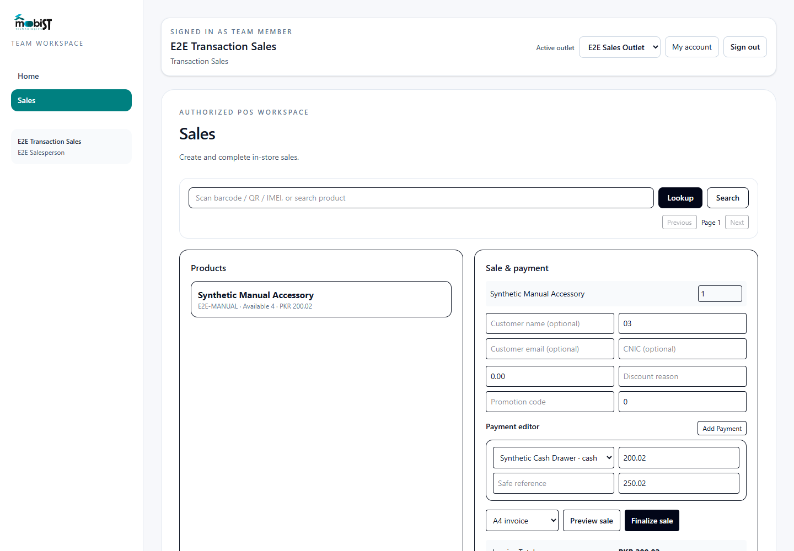

The sale cannot finalize unless authoritative payment/remaining rules are satisfied.

### 5.3 Split tender

Use **Add Payment** for each tender component. Confirm:
- Invoice Total
- Payments
- Remaining
- cash tender/change where applicable

A payment destination is outlet-scoped. Do not reuse another outlet's destination.

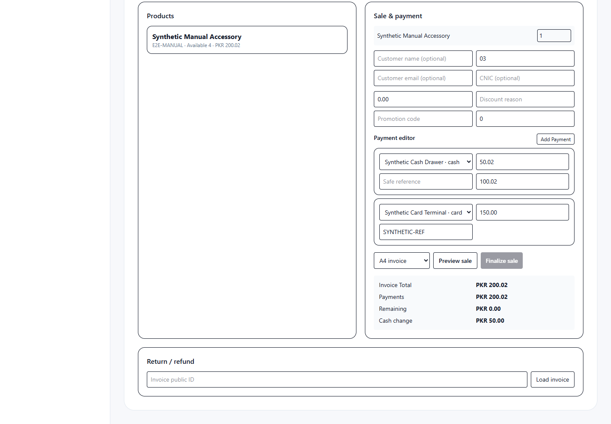

### 5.4 Returns

Open the relevant historical sale/invoice and start the return workflow. The backend prevents:
- returning more than the eligible sold quantity;
- restoring stock that is not accepted/sellable;
- rewriting the original invoice/sale snapshot.

A return appends compensating history rather than mutating the historical sale.

### 5.5 Refunds

Refunds are bounded by verified collected money and original tender/provider evidence. Use the original destination/method unless an authorized override workflow is explicitly available.

Changing the refund destination/method requires the dedicated override/approval permissions where applicable. A provider status label by itself is not proof that money was refunded.

### 5.6 Reconciliation

Users with `shop.payments.reconcile` can reconcile recorded POS settlements. Reconciliation never authorizes a payment provider or external bank action by itself.

## 6. Invoices, customers, Email and WhatsApp

### 6.1 Historical invoices

Open **POS > Invoices & customers** to inspect sale history and customer records.

Historical documents are regenerated from immutable transaction-time snapshots. Later edits to the customer, product, business profile or warranty configuration do not rewrite the original invoice evidence.

### 6.2 Invoice actions

The canonical document workflow provides:
- Preview
- Print
- explicit Save PDF
- Email attachment
- assisted WhatsApp

Finalizing a sale does **not** automatically download or send a document.

### 6.3 Email

Email sending requires:
- `shop.documents.send`;
- a configured/authorized Gmail integration;
- an approved recipient and canonical PDF attachment.

The system records provider success only after the provider API succeeds. If authentic Gmail is not connected, do not describe the document as sent.

### 6.4 WhatsApp

WhatsApp is assisted, not a delivery-confirmation provider integration. Mobisttech may prepare/open the message workflow, but it does not claim a message is sent/delivered.

When required, manually attach the generated canonical PDF before sending in WhatsApp.

## 7. Inventory, products and master data

### 7.1 Product catalogue and definitions

Open **POS > Inventory** for products, stock and units.

Product definition includes the approved catalogue attributes and current warranty configuration. Product name remains editable/manual. Serialized units carry their own unit/IMEI identity and device configuration.

Use **Master data** only with `config.master-data.manage` to maintain controlled option lists. Archiving an option preserves historical labels/usages rather than silently rewriting old records.

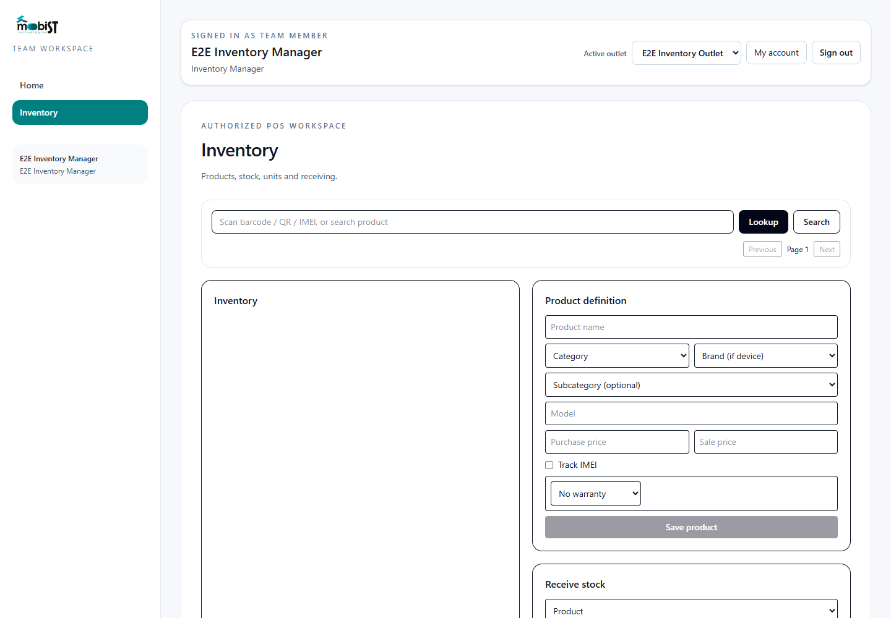

### 7.2 Receiving/acquisition

Record acquisition/receiving through the Inventory or Procurement workflow. Verify:
- outlet
- source/supplier
- quantity
- exact unit cost
- serialized unit/IMEI details where required
- private evidence/document handling

Stock and acquisition changes are transactional; a failed operation must not be treated as partially received.

### 7.3 Stock adjustment

Use bounded stock-adjustment controls rather than editing counters directly. Adjustments are permission/outlet scoped and are recorded in movement history.

### 7.4 Scanner and labels

Barcode/QR/IMEI input is a lookup/entry convenience and never bypasses validation. Retail-label generation/printing requires the relevant authorization (including `shop.labels` where applicable).

### 7.5 Stocktake

Users with `shop.stocktake` can perform stock counts. Variance approval is separately protected by `shop.stocktake.approve`.

Do not use stocktake to bypass a sale, acquisition, return or transfer workflow.

### 7.6 Transfers

Stock transfers preserve dispatch/receive separation:
- dispatch requires `shop.transfers.dispatch`;
- receive requires `shop.transfers.receive`.

The receiving outlet must explicitly receive the transfer; dispatch alone is not receiving evidence.

## 8. Procurement and additional retail operations

Users with `shop.procurement` can manage:
- supplier profiles/contacts;
- purchase orders;
- partial receiving;
- purchase-order cancellation where permitted;
- supplier/order/receipt history;
- reorder recommendations.

Purchase-order supplier snapshots are historical. Later supplier-profile edits do not rewrite the old order.

Receiving a purchase order creates the normal stock acquisition/units through the shared inventory authority. Multi-line receiving is atomic: if the receipt fails, do not treat any line as accepted.

Reorder recommendations are advisory. They do not automatically place purchase orders.

### 8.1 Trade-in / buyback

Users with `shop.trade-in` can manage individual-seller trade-in/buyback intake. The guarded workflow records seller/source identity, device identifiers, condition/diagnostics and exact PKR valuation, then requires approval before stock receipt. Sale-credit treatment is a tender/monetary adjustment, not a discount. Seller CNIC/phone evidence remains private. Cancel before receipt when the intake should not proceed; received trade-ins become normal authoritative inventory.

### 8.2 Promotions and coupons

Authorized configuration supports fixed/percentage promotions, optional coupon codes, validity windows, minimum subtotal, usage limits, product/category applicability and controlled stacking. POS and Website calculations are server-owned. Returns preserve the original discount allocation instead of recalculating the current promotion. Never manually edit an invoice to imitate a promotion.

### 8.3 Loyalty (when enabled)

Loyalty is optional and versioned under `config.loyalty.manage`. Points are rewards, not money/accounting balances. The system owns earn, redemption, expiry and return reversal. Disabling loyalty stops new earning/redemption without deleting historical balances/claims. Loyalty redemption does not stack with unsupported discount combinations.

### 8.4 Bulk data

Approved bulk workflows support bounded catalogue, price, managed master-data and inventory CSV/XLSX-style operations. Always run **Preview** first and resolve row validation errors before mutation. Formula-leading cells are rejected/escaped for spreadsheet safety. Use the selected recovery mode (`whole_batch` or row-level) intentionally; bulk inventory never edits stock counters directly.

## 9. Warranty, claims and paid repairs

### 9.1 Warranty intake

Open **POS > Warranty** with `shop.warranty`.

Eligibility uses sale-time warranty evidence, not today's product configuration. Warranty type/duration and invoice warranty clauses are snapshotted at sale time.

### 9.2 Claim creation

Open **POS > Claims** with `shop.claims`.

A claim must reference an eligible sold occurrence. Serialized claims require the exact sold physical unit. Returned quantities and active claims reduce the available claimable quantity.

### 9.3 Claim lifecycle

The standard lifecycle is:

`received -> diagnosing -> repaired -> ready_for_collection -> delivered -> closed`

Allowed cases may move from an active stage to `rejected`. Rejected and closed claims are terminal.

Each accepted transition appends immutable event history.

### 9.4 Warranty receipt/document

Use the canonical warranty/claim document Preview/Print/Save/Email/WhatsApp workflow. Historical warranty output comes from sale/claim snapshots and is not rewritten by current catalogue changes.

### 9.5 Paid repairs

Paid repairs are separate from warranty claims and require `shop.repairs`. Do not convert an out-of-warranty paid repair into a covered warranty claim without valid claim eligibility.

## 10. Cash operations and reporting

### 10.1 Cash session / Day Closing

Open **POS > Operations** when your permissions expose cash operations.

Use the cash workflow to:
- open/operate the applicable cash session;
- record permitted cash/expense events;
- review expected versus actual cash;
- close the session;
- route material variance/expense approvals to an authorized approver.

Do not close/reconcile around unresolved money or active operational blockers.

### 10.2 Expenses / payouts and approval

Cash/operational expenses remain outlet scoped and auditable. Record only legitimate business expenses through the supported Operations workflow. Variance/expense approval requires the appropriate approver permission; do not balance a cash drawer by inventing an expense or payout.

### 10.3 Payment Mix and settlement reconciliation

Reports distinguish invoice totals from tender mix, destination/provider fees, settlements and variance. Use Payment Mix to understand how sales were collected; use reconciliation to compare recorded tender/destination evidence with the applicable settlement evidence. Do not collapse split tender into one synthetic payment method.

### 10.4 Reports

Open **POS > Reports** with `reports.view`.

Reports are outlet/date scoped and may include:
- invoices/sales
- returns/refunds
- payment/tender mix
- destination/settlement views
- inventory/category performance
- profit figures
- warranty/claims
- procurement/stocktake/transfer/cash activity where applicable

Exports must not include private secrets such as raw payment credentials, seller documents or unrelated customer evidence.

## 11. Outlet profile and Admin platform

### 11.1 Outlet profile

Use **POS > Outlet profile** to edit the active assigned outlet's allowed business contact/display information. Canonical business/global configuration remains separately protected.

### 11.2 Canonical Business Profile

Platform Administration includes **Canonical Business Profile**. It controls the approved business name, business email and public Website identity used by current consumers. Updating it requires `admin.business-profile.manage` and recent authentication. Do not use this form to invent a different legal holder or bypass the separate owner/legal approval gate.

### 11.3 Platform Administration

Open **Platform Administration** for protected configuration. Its header also links to:
- POS
- My account
- Website performance
- Website activity
- Website commerce
- Digital Operations
- Data Reset
- Google integrations

Visible links depend on permission.

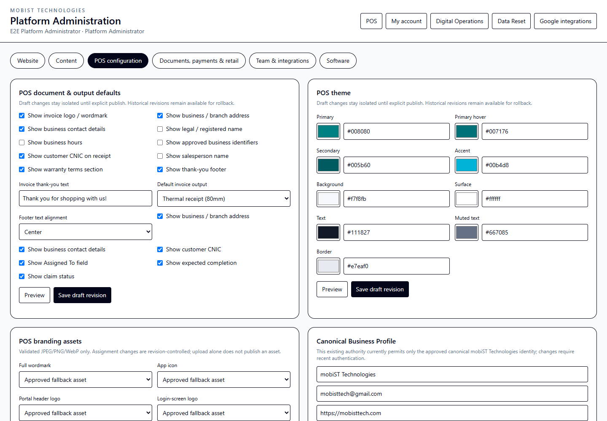

### 11.4 Team Members and delegated roles

Authorized administrators can create/manage Team Members, roles and outlet assignments. Important protections include:
- subordinate/delegated-management boundaries;
- protected Full Access assignment;
- separate outlet assignment;
- security-state management;
- last-owner/last-authority safeguards.

Do not grant Full Access merely to make a screen visible. Grant only the permissions required for the person's actual job.

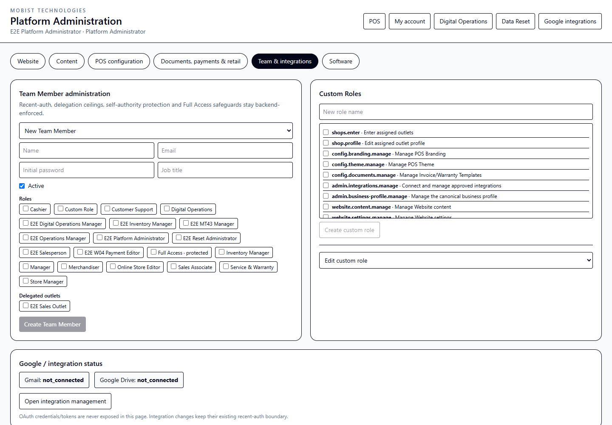

## 12. POS presentation and configuration

Protected Platform Administration controls include versioned draft/publish/rollback for supported POS configuration domains such as:
- branding;
- theme;
- invoice/warranty document configuration;
- master data;
- portal navigation/presentation;
- dashboard/report presentation.

Use this pattern:
1. edit the draft;
2. Preview;
3. Save draft revision;
4. review exact snapshot/effect;
5. Publish only with the separate publish permission;
6. Roll back through a new controlled revision when necessary.

Publishing is not a substitute for legal/provider authorization.

## 13. Website operating mode

Mobisttech supports the approved Website operating modes:
- hybrid;
- digital_only;
- commerce_only.

Mode changes use separate draft/preview/publish authority. A mode can intentionally remove capabilities from the public Website while historical customer/project/order data remains protected/readable through its supported owned contract.

Before publishing a mode:
1. review capability impact;
2. preview the mode;
3. confirm public navigation/content behavior;
4. publish only with the dedicated mode-publish permission.

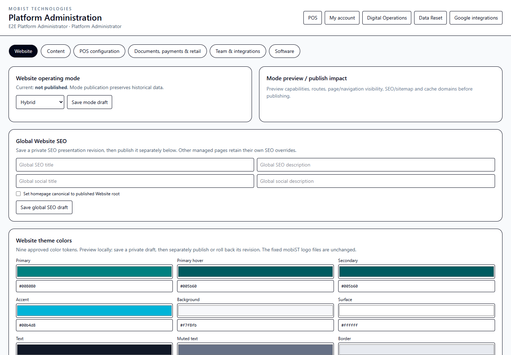

## 14. Website CMS, navigation, SEO and media

### 14.1 CMS publishing model

Website content is versioned. Drafts remain private until explicit publication.

Common protected capabilities include:
- pages/content;
- navigation;
- homepage/presentation;
- header/footer;
- branding;
- theme;
- SEO;
- media;
- promotions;
- policies;
- Software Products.

### 14.2 Navigation

Managed navigation supports nested items and approved destinations. A presentation change does not bypass route/backend capability checks.

Preview navigation before publishing, especially after changing Website mode.

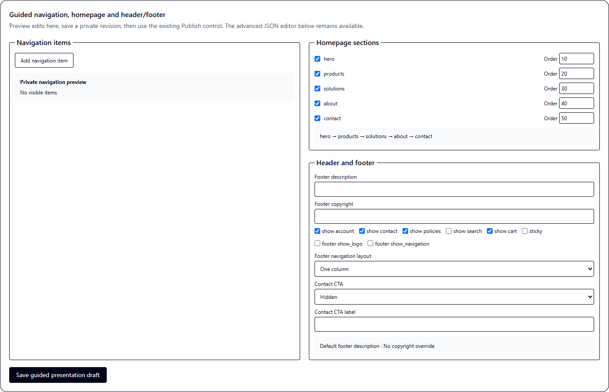

### 14.3 Media

Upload only approved safe media. Media usage/history prevents unsafe deletion when an asset remains referenced. Replacement/upload are separate controls.

Do not expose private acquisition/customer/project files through public Website media.

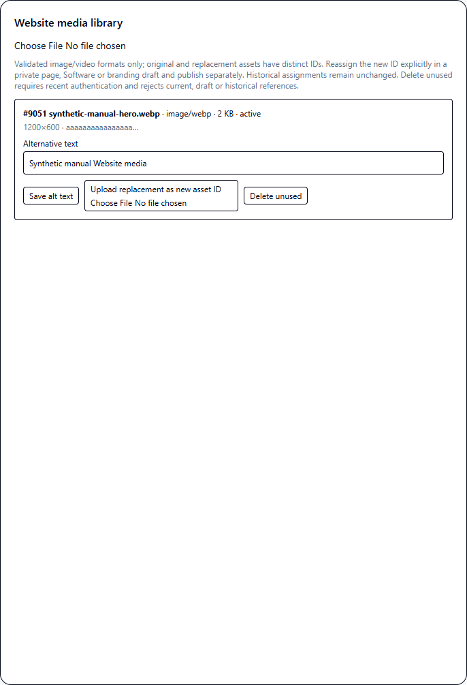

### 14.4 SEO

Use the SEO controls for supported:
- title/description;
- social title/description/image;
- canonical route;
- indexing/discovery configuration.

Do not use canonical/external URLs to bypass the application's allowed navigation/URL safety rules.

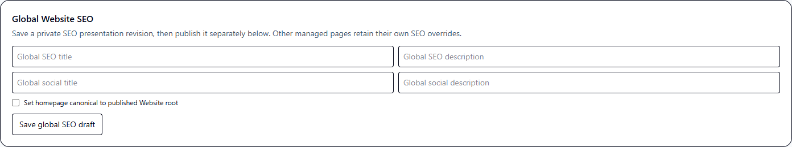

## 15. Legal policies

The CMS supports managed policy types including the required/conditional privacy, terms, returns/refunds, shipping/delivery, warranty, cookie, digital-services and payment-disclosure content.

Legal-policy workflow is fail-closed:
1. create/update the draft;
2. record unresolved decisions as unresolved rather than inventing facts;
3. complete factual verification;
4. complete required owner/legal review;
5. apply correct effective date/version;
6. publish only with authorized Website publish permission.

**Current pre-launch state:** exact registered legal holder and final owner/legal commercial-policy approval remain pending. Do not publish unapproved final legal claims.

Cookie policy remains conditional when no non-essential tracking is active.

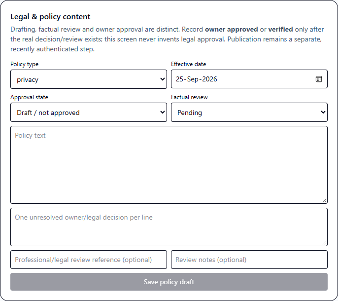

## 16. Website commerce administration

Users with Website commerce permissions can manage the supported order/review administration.

### 16.1 Website payment channels

The Website payment choices are exactly:
- Cash on Delivery
- JazzCash
- Easypaisa
- Credit/Debit Card through an approved hosted/tokenized processor

Website Bank Transfer is not an approved checkout choice.

External electronic channels remain unavailable/default-OFF until their authentic merchant-specific integration, sandbox evidence and separate activation approval are complete.

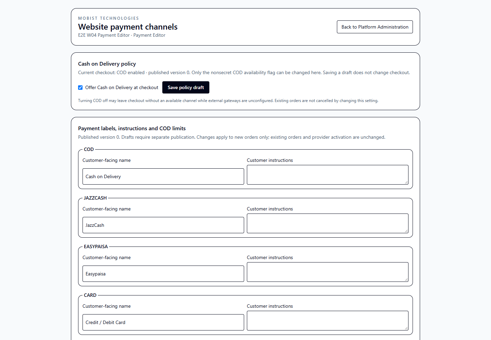

### 16.2 Orders

Use Website commerce administration to review/manage order state according to the protected workflow. Do not mark an order paid from a UI label unless authoritative payment evidence exists.

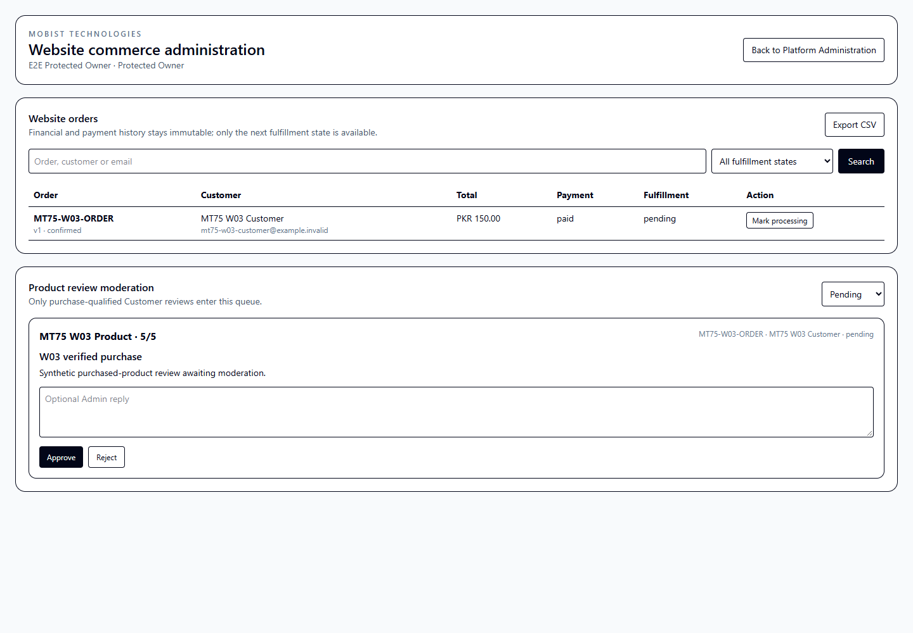

### 16.3 Reviews

Qualified customer reviews can enter moderation. Admin moderation/reply controls are permission protected. Publication must preserve the real review state and must not fabricate customer content.

### 16.4 Website activity / audit

Users with `website.audit.view` can open **Website activity** to review bounded administration history. Use search/filter/pagination as provided; the viewer intentionally excludes raw private payload/IP/device metadata. Audit visibility is read-only evidence and does not grant the underlying content/payment permission.

### 16.5 Website performance

Authorized users can inspect Website commerce/conversion reporting, including paid/unpaid order measures, digital/commerce mix, service requests and bounded recent/top/daily projections.

## 17. Digital Services and client projects

Open **Digital Operations** for the permitted service/lead/project functions.

Depending on permission, the workspace provides:
- services, pricing models, packages and add-ons;
- consultation settings;
- leads/enquiries;
- owner assignment;
- customer/project creation;
- versioned proposals;
- milestone schedules;
- project states/history;
- private client files;
- conversion reporting.

Approved proposal/milestone snapshots are authoritative. Later public pricing/content changes do not rewrite an accepted project.

Private client files are never public Website media.

Digital-service commercial cancellation/refund/ownership wording remains subject to the final owner/legal policy approval before public legal publication.

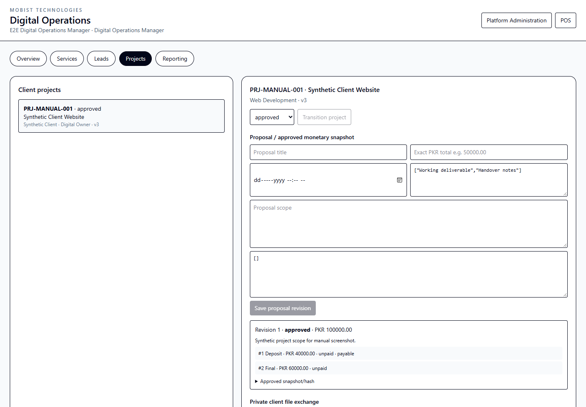

## 18. Software Product publishing

Mobisttech provides a reusable Software Product workflow; it is not hard-coded to one product.

An authorized publisher can manage:
- product identity/slug;
- Overview;
- Privacy;
- Terms;
- FAQ;
- media/SEO;
- releases/version history;
- release detail;
- preview;
- publication;
- rollback/archive.

Public route family includes:
- `/software/{slug}`
- `/software/{slug}/privacy`
- `/software/{slug}/terms`
- `/software/{slug}/faq`
- `/software/{slug}/releases`
- `/software/{slug}/releases/{version}`

Do not invent a download URL, version/date, license holder or “latest” claim. Use only verified release facts for the specific product.

The reconciled mobiST POS reference set is private factual source material for this workflow; public publication still requires the appropriate owner/legal/product authorization.

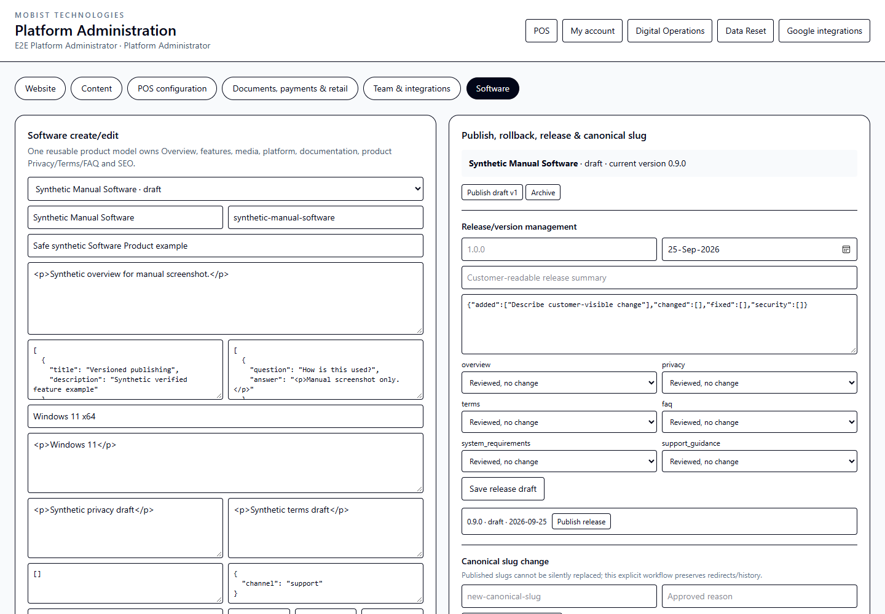

## 19. Google integrations and backup

### 19.1 Integration configuration

Use the protected **Google integrations** area only with the required integration permission.

Secrets/tokens are backend-only and must not be copied into screenshots/manual examples.

Authentic Gmail/Drive connectivity remains an external acceptance item until the approved account/scopes and genuine test evidence exist.

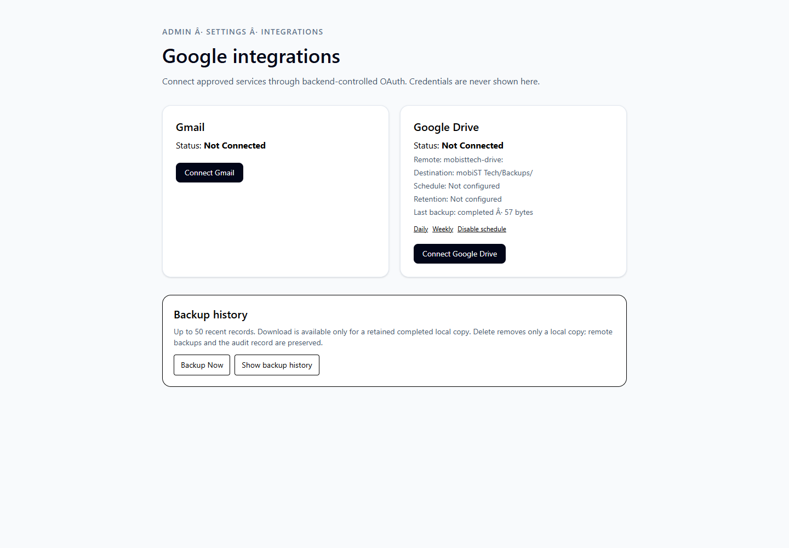

### 19.2 Backups

Authorized backup operations can create, list, download and delete protected backup artifacts. Backup/recovery evidence uses the target application and private backup namespace.

Before any destructive action:
1. create/verify the required backup;
2. confirm target/environment;
3. confirm exact operator authorization;
4. perform verify-only rehearsal where required;
5. retain recovery/audit evidence.

Destructive production restore remains PRE-LAUNCH/action-specific HOLD.

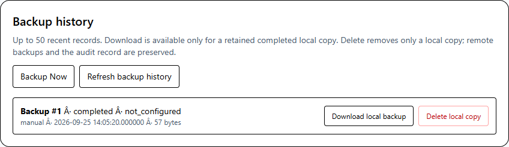

## 20. Data Reset

Open **Data Reset** only with the required reset permission.

Supported guarded levels are:
- Transactional Data Reset
- Business Data Reset
- Factory Reset

The workflow requires:
- recent Admin re-authentication;
- a current dry-run preview;
- exact typed confirmation;
- no unresolved dependency/operational barriers;
- automatic verified encrypted backup before deletion.

A changed scope/count/schema/code hash makes the preview stale and blocks execution.

Factory Reset preserves required system/bootstrap authority. The product does not provide an arbitrary SQL/shell reset route.

**Production destructive execution is not authorized by this manual.**

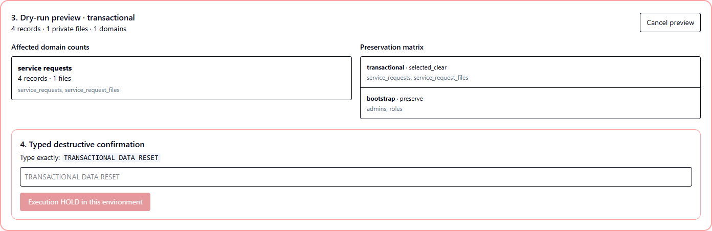

## 21. Customer Website

Public capability depends on the published Website mode and CMS state.

Supported public/customer experiences include:
- Home
- Products
- Categories
- Product details
- Compare
- Cart
- Checkout
- Services
- Service detail
- Knowledge
- Enquiry
- managed pages
- Software Product pages/releases
- customer account
- customer orders/order detail
- customer projects/project detail
- password reset

### 21.1 Products and checkout

Catalogue availability is stock/hold aware. A product shown publicly does not authorize overselling.

At checkout:
1. verify customer/delivery details;
2. review the authoritative order total;
3. choose only an available payment channel;
4. submit once and allow idempotent replay handling to return the original order rather than intentionally duplicating it.

For COD, stock remains held according to the COD lifecycle until collection/authorized cancellation. Do not fabricate a refund where no payment was collected.

### 21.2 Customer account

Signed-in customers can access only their own supported order/project records. Admin and Customer realms are separate; being an Admin does not automatically grant a Customer account session, or vice versa.

### 21.3 Saved items, alerts and reviews

Customers can use **Save for later** / wishlist behavior. Guest saved items can be claimed/deduplicated into the signed-in Customer account. Availability/price alerts require explicit consent and expose preference/unsubscribe controls. External notification delivery remains disabled until an approved provider is genuinely configured.

Eligible verified-purchase customers can submit reviews through the owned Customer workflow. Review publication remains subject to moderation.

### 21.4 Customer invoices

The final Customer Website code does not expose a standalone Customer Invoice screen/control. Customer-owned order history/detail is supported, while canonical POS invoice document delivery remains an Admin/POS workflow. Do not present a separate Customer Invoice UI in screenshots or instructions unless a later verified product change adds one.

### 21.5 Service/project experience

Digital customers can use the published service/enquiry flow and, when linked to an account/project, access their permitted project/proposal/file history.

## 22. mobiST Control (Windows)

The canonical Windows utility is **mobiST Control** under `tools/mobist-control`.

It controls the owned local development application services:
- Backend Laravel HTTP
- Backend Vite
- Website Next.js

Main operations:
- Status
- Start / Stop / Restart Backend
- Start / Stop / Restart Website
- Start All
- Stop All
- Open Backend
- Open Website

Operational rules:
- repeated Start must not create duplicate owned services;
- Stop All is idempotent;
- Website can truthfully show Blocked while Backend still starts;
- stale `backend/public/hot` is cleared when Vite is offline so built assets do not point at a dead HMR server;
- database lifecycle is separate in `tools/dev/Database.ps1`;
- current target services bind loopback-only; LAN/QR publishing is intentionally not part of the canonical Control target;
- Desktop Commander is not an application lifecycle dependency.

## 23. Troubleshooting guide

### POS item is missing
Check:
1. correct Admin account;
2. active assigned open outlet;
3. required permission;
4. navigation presentation visibility;
5. product/outlet state.

### Sale cannot complete
Check:
- stock/unit eligibility;
- reservation/hold state;
- server total;
- payment total/remaining;
- configured non-cash destination;
- cash tendered amount.

### Warranty claim is denied
Check:
- original sale occurrence;
- warranty type/duration/expiry;
- returned quantity;
- existing active claim;
- exact serialized unit for device claims.

### Website content is not public
Check:
- draft versus published revision;
- Website mode;
- capability scope;
- navigation state;
- publish permission.

### Electronic Website payment is unavailable
This may be correct. External JazzCash/Easypaisa/card channels remain OFF until authentic provider onboarding and explicit activation are completed.

### Email cannot send
Confirm the approved Gmail integration is genuinely connected and the user has document-send permission. A local/mock test is not provider delivery evidence.

### Reset is blocked
Read the dry-run preview and resolve the named dependency/operational barrier. Never bypass a reset blocker by direct database deletion.

### Local Website/Backend does not start
Use mobiST Control **Status**, then restart only the affected owned service. Keep the database lifecycle separate. Do not kill unrelated processes.

## 24. Release and support status

The current manual is built from the MT-7.5 development-complete baseline. Development completion does not equal launch approval.

Mandatory separate PRE-LAUNCH tracks currently include:
- authentic JazzCash/Easypaisa/hosted-card provider onboarding and activation;
- production/domain/TLS/real-customer-data authorization;
- authentic Gmail/Google evidence where required;
- exact registered legal holder and final legal-policy approval/publication;
- action-specific destructive/real-data operations.

Refer to `docs/HOLD_PRE_LAUNCH_REGISTER.md` for the authoritative current state.

## Appendix A - Key protected Admin routes

| Area | Route |
|---|---|
| POS | `/internal/admin/pos` |
| Platform Administration | `/internal/admin/platform` |
| My account | `/internal/admin/manage-account` |
| Website performance | `/internal/admin/website-performance` |
| Website activity | `/internal/admin/website-audit` |
| Website commerce | `/internal/admin/website-commerce` |
| Digital Operations | `/internal/admin/digital-operations` |
| Data Reset | `/internal/admin/reset-administration` |
| Google integrations | `/internal/admin/settings/integrations` |

Routes remain backend permission protected even if presentation/navigation is customized.

## Appendix B - Manual production checklist

Before this manual can close MT-7.6:
- [x] Canonical Markdown operational baseline exists.
- [x] Final MT-7.5 development baseline and PRE-LAUNCH boundary are stated.
- [x] POS, payments, documents, inventory/procurement, warranty, cash/reporting, Website CMS/legal/Digital Services/Software, integrations, backup/reset, Control and customer Website are covered.
- [ ] Capture current safe UI screenshots with synthetic/demo data only.
- [ ] Map each screenshot to the exact section and role/permission.
- [ ] Execute documented navigation/procedures against the final product where screenshot evidence is required.
- [ ] Complete final supported-workflow coverage audit against the permission/navigation catalogue.
- [ ] Generate same-content DOCX mirror.
- [ ] Generate same-content PDF mirror.
- [ ] Verify Markdown/DOCX/PDF content parity.
- [ ] Render DOCX/PDF and visually QA every page.
- [ ] Verify links, TOC, screenshot readability and destructive/security warnings.
- [ ] Record final Git/release checkpoint.

